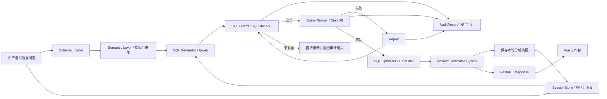

# Data Analyst Agent

自然语言驱动的数据库分析与 SQL 优化系统。用中文提问，系统自动生成安全 SQL、执行查询、修复错误，并返回自然语言解释和图表。

## 项目亮点

- **完整 Agent 工作流**：使用 LangGraph 编排 Schema 加载、SQL 生成、安全校验、执行、修复、优化建议和答案生成。
- **业务语义层**：用 YAML 定义销售额、退款率、复购率、客单价等指标口径和地区、品类等维度，降低 LLM 猜字段和猜 JOIN 的风险。
- **LLM SQL 安全治理**：SQLGlot AST 校验只允许安全查询，拦截多语句、系统表、危险 DuckDB 文件读取函数，并自动注入 LIMIT。
- **SQL 自动修复闭环**：SQL 执行失败后将错误信息反馈给修复 Agent，最多重试 3 次，每次修复后重新经过 SQL Guard。
- **规则化 SQL 优化建议**：基于 SQL AST、查询结果规模和 DuckDB EXPLAIN 执行计划生成可解释优化建议。
- **双层评测体系**：内置 32 条 NL2SQL case 和 6 条确定性 SQL Repair 故障注入 case，可分别量化生成、安全与修复能力。
- **多轮分析追问**：通过 `session_id` 保存最近几轮问题、SQL 和结果摘要，支持“按地区拆一下”这类省略式追问。
- **安全审计报告**：API 返回结构化 `audit_report`，前端工作台展示 SQL 生成、Guard 校验、LIMIT 注入、修复和执行证据。
- **LLM 调用可观测性**：记录每次 Qwen 调用的节点、Token、耗时、尝试次数和可选估算成本，并接入审计与离线评测报告。
- **可验证工程质量**：后端测试使用隔离 DuckDB 测试库，不依赖本机真实数据文件；当前后端测试覆盖 124 个用例。

## 核心功能

- **自然语言转 SQL** — 用户提问，LLM 生成 DuckDB SQL
- **SQL 安全校验** — SQLGlot AST 解析，只允许 SELECT/WITH/EXPLAIN，自动注入 LIMIT
- **SQL 自动修复** — 执行失败时 LLM 分析错误并修复，最多重试 3 次
- **SQL 优化建议** — 基于 EXPLAIN、结果规模和 SQL 结构输出优化建议
- **离线评测报告** — 固定 NL2SQL case 与确定性 Repair 故障集量化生成、执行、修复和安全表现
- **多轮分析上下文** — 基于 session_id 复用上一轮分析意图，支持连续追问
- **安全审计报告** — 输出 Guard 命中规则、LIMIT 注入、修复次数和执行事件
- **LLM 资源审计** — 区分数据库执行与模型调用耗时，量化 Token、重试和可选成本
- **自然语言答案** — LLM 将查询结果转换为易懂的解释
- **数据可视化** — ECharts 自动选择图表类型
- **三栏工作台** — 输入/结果/SQL 详情一目了然

## 核心架构



### 安全策略

SQL Guard 位于所有 SQL 执行前，核心规则包括：

- 只允许单条 `SELECT`、`WITH` 和 `EXPLAIN SELECT`
- 禁止 `DROP`、`DELETE`、`UPDATE`、`INSERT`、`ALTER` 等 DDL/DML
- 禁止访问 `information_schema`、`pg_catalog` 和 `duckdb_*` 系统元数据
- 禁止调用 `read_csv_auto`、`read_parquet`、`duckdb_tables()` 等文件读取/元数据函数
- 使用 AST 判断顶层 LIMIT，避免字符串字面量中的 `LIMIT` 绕过限制

### 优化建议

SQL Optimizer 在查询成功后运行，不参与失败 SQL 的修复流程。当前规则包括：

- `SELECT *`：建议只选择分析需要的字段
- 结果达到 `SQL_MAX_ROWS`：建议增加 WHERE 条件、时间范围或分页
- EXPLAIN 中包含顺序扫描：建议增加筛选条件或先聚合再排序

## 技术栈

| 层 | 技术 |
|---|------|
| 前端 | Vue 3 + Vite + Element Plus + Pinia + ECharts |
| 后端 | FastAPI + LangGraph + SQLGlot |
| 数据库 | DuckDB |
| LLM | Qwen API (DashScope) |

## 快速开始

### 方式一：Docker（推荐）

```bash
# 1. 克隆项目
git clone <repo-url>
cd data_analyst_agent

# 2. 配置环境变量
cp .env.example .env
# 编辑 .env，填入 QWEN_API_KEY

# 3. 一键启动
docker-compose up -d

# 4. 访问
# 前端: http://localhost
# API 文档: http://localhost:8000/docs
```

### 方式二：本地开发

```bash
# 后端
cd backend
pip install -r requirements.txt
python ../database/seed_data.py    # 初始化数据库
uvicorn app.main:app --reload      # 启动后端 (localhost:8000)

# 前端（新终端）
cd frontend
npm install
npm run dev                        # 启动前端 (localhost:3000)
```

## 示例问题

- 统计 2024 年每个月的订单数量
- 找出销售额最高的 5 个商品
- 统计各地区的客户数量
- 分析各商品类别的退款率
- 多轮追问：先问 `统计 2024 年每个月销售额`，再问 `按地区拆一下`

## API 接口

| 方法 | 路径 | 说明 |
|------|------|------|
| GET | `/health` | 健康检查 |
| GET | `/api/schema` | 数据库 Schema |
| POST | `/api/chat/query` | 自然语言查询 |

### 查询示例

```bash
curl -X POST http://localhost:8000/api/chat/query \
  -H "Content-Type: application/json" \
  -d '{"question": "统计订单总数"}'
```

响应中的 `data.audit_report` 会包含最终 SQL、安全状态、是否自动注入 LIMIT、被拦截规则和审计事件列表。

### 多轮查询示例

```bash
curl -X POST http://localhost:8000/api/chat/query \
  -H "Content-Type: application/json" \
  -d '{"session_id": "demo-session", "question": "统计 2024 年每个月销售额"}'

curl -X POST http://localhost:8000/api/chat/query \
  -H "Content-Type: application/json" \
  -d '{"session_id": "demo-session", "question": "按地区拆一下"}'
```

## 项目结构

```
data_analyst_agent/
├── backend/
│   ├── app/
│   │   ├── api/           # API 端点
│   │   ├── agents/        # LangGraph Agent 工作流
│   │   ├── db/            # 数据库连接和 Schema 加载
│   │   ├── semantic/      # 业务语义层配置加载
│   │   ├── security/      # SQL 安全校验
│   │   ├── services/      # LLM 服务
│   │   ├── models/        # Pydantic 模型
│   │   └── utils/         # 日志和异常
│   ├── evaluation/        # NL2SQL 评测 case、runner 和报告
│   └── tests/             # 测试用例
├── frontend/
│   ├── src/
│   │   ├── api/           # API 客户端
│   │   ├── components/    # Vue 组件
│   │   ├── stores/        # Pinia 状态
│   │   └── views/         # 页面视图
│   └── nginx.conf         # Nginx 配置
├── database/
│   ├── init.sql           # 数据库 Schema
│   └── seed_data.py       # 种子数据脚本
├── docker-compose.yml     # Docker 编排
└── docs/                  # 项目文档
```

## 运行测试

```bash
cd backend
pytest -q
```

当前验证结果：`124 passed`。

## 运行评测

```bash
cd backend
python -m evaluation.evaluator
python -m evaluation.repair_evaluator
```

NL2SQL 评测包含 32 条固定 case；独立 SQL Repair 评测包含 6 条确定性故障注入 case。报告输出到 `backend/evaluation/reports/`，同时生成 Markdown 和 JSON，并展示调用次数、Token、LLM 耗时和可选估算成本。当前 Qwen Plus Repair 基线为 `6/6（100%）`，资源基线详见 [Qwen Plus LLM 调用成本与耗时基线分析](docs/Qwen_Plus_LLM调用成本与耗时基线分析.md)。

## 面试准备

如果要用这个项目投递或面试，建议先阅读：

- [开发文档 v0.3：企业级 NL2SQL Agent 升级版](docs/data_analyst_agent_开发文档_v_0_3.md)
- [项目面试讲述稿](docs/interview_guide.md)
- [数据库设计](docs/database_design_md.md)
- [前端工作台开发说明](docs/frontend_workbench_development_notes.md)

## 环境变量

| 变量 | 说明 | 默认值 |
|------|------|--------|
| `QWEN_API_KEY` | DashScope API Key | 必填 |
| `QWEN_MODEL` | Qwen 模型名 | `qwen-turbo` |
| `QWEN_INPUT_PRICE_PER_MILLION_TOKENS` | 可选，每百万输入 Token 单价 | 留空 |
| `QWEN_OUTPUT_PRICE_PER_MILLION_TOKENS` | 可选，每百万输出 Token 单价 | 留空 |
| `SQL_TIMEOUT` | 查询超时（秒） | `30` |
| `SQL_MAX_ROWS` | 最大返回行数 | `1000` |
| `SQL_MAX_RETRIES` | SQL 修复最大重试 | `3` |

## License

MIT
