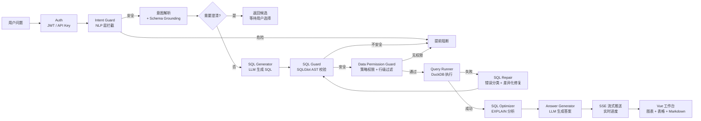

# Data Analyst Agent

自然语言驱动的数据库分析系统。用中文提问，系统自动生成安全 SQL、执行查询、修复错误，并返回自然语言解释和交互式图表。

## 项目亮点

**12 节点 LangGraph Agent 工作流** — 不是简单调 API，而是完整的有向图编排：意图解析 → Schema Grounding → 主动澄清 → SQL 生成 → SQL 安全校验 → 数据权限校验 → 执行 → 自动修复 → 优化建议 → 答案生成。

**三层安全治理** — Intent Guard 在 LLM 调用前阻断危险意图（100% 阻断率），SQL Guard 在 AST 层面校验生成的 SQL，Data Permission Guard 在执行前按 YAML 策略检查角色级表/字段权限并注入行级过滤。覆盖破坏性操作、凭据访问、系统表访问、文件读取和敏感字段越权访问。

**SQL 自动修复闭环** — 执行失败后将错误信息反馈给修复 Agent，根据错误类型选择差异化修复策略，最多重试 3 次，每次修复后重新经过安全校验。

**500+ 测试 + 70+ 条评测/回归用例** — 后端 512 个测试、前端 48 个单元测试、17 个 E2E 测试、65 条结构化评测用例和 5 条数据权限回归评测覆盖核心安全链路。

## 核心架构



## 技术栈

| 层 | 技术 |
|---|------|
| 前端 | Vue 3 + Vite + Element Plus + Pinia + ECharts + vue-router |
| 后端 | FastAPI + LangGraph + SQLGlot + slowapi + PyJWT |
| 数据库 | DuckDB（嵌入式）/ PostgreSQL（生产） |
| LLM | MiMo v2.5 Pro（兼容 OpenAI API） |
| 测试 | pytest + Vitest + Playwright |
| 部署 | Docker + GitHub Actions CI/CD |

## 功能清单

### 后端

- 自然语言转 SQL（LangGraph 12 节点工作流）
- Intent Guard + SQL Guard + Data Permission Guard 三层安全治理
- 角色级表/字段权限（admin / analyst / support，越权 SQL 不执行、不修复）
- YAML 数据权限策略 + 行级 SQL 过滤（执行前由后端 AST 改写，不依赖 LLM）
- SQL 自动修复（错误分类 + 差异化策略 + 最多 3 轮重试）
- 分层意图解析 + Schema Grounding（指标/维度映射）
- 主动澄清机制（模糊问题暂停，返回候选等待用户选择）
- 多轮分析追问（session_id 上下文复用）
- SSE 流式响应（asyncio.Queue 真实进度推送）
- LLM 调用可观测性（Token、耗时、成本统计）
- JWT Token + API Key 双模式认证（未配置密钥时保持本地开发放行）
- 速率限制（slowapi，默认 30 次/分钟）
- Alembic 数据库迁移（DuckDB + PostgreSQL 双后端）
- 结构化审计报告（身份摘要、权限可观测性、Guard 命中、LIMIT 注入、修复事件）

### 前端

- 三栏工作台布局（输入 / 结果 / SQL 详情）
- SSE 流式进度条（真实阶段 + 百分比）
- ECharts 交互式图表（柱状 / 折线 / 饼图 / 散点 + 多列数据支持）
- Markdown 答案渲染（marked）
- 表格分页（50 行/页）+ CSV / Excel 导出（xlsx）
- 暗色模式切换
- 查询收藏（localStorage 持久化）
- 历史记录面板
- vue-router 路由（查询结果可通过 URL 分享）
- 响应式布局（桌面端 / 平板端 / 移动端）
- 权限演示工作台（admin / analyst / support 一键切换，审计面板展示身份和 authorization 事件）

### 评测体系

| 评测 | 用例数 | 当前指标 |
|------|--------|----------|
| NL2SQL 电商评测 | 32 条 | 执行成功率 100% |
| 危险意图评测 | 37 条 | 阻断率 100%，误杀率 0% |
| Intent Guard 提前阻断 | 8 条 | 提前阻断率 100% |
| SQL Repair 故障注入 | 6 条 | 修复成功率 100% |
| 结果正确性黄金基准 | 10 条 | 正确率 100% |
| 分层意图 + Grounding | 7 条 | 六项指标 100% |
| 数据权限评测 | 5 条 | 权限决策 / 阻断规则 / 行级过滤预期 100% |
| 结构化评测用例 | 65 条 | 覆盖 11 个类别 |

## 快速开始

### 方式一：Docker（推荐）

```bash
git clone <repo-url>
cd data_analyst_agent
cp .env.example .env
# 编辑 .env，填入 QWEN_API_KEY
docker-compose up -d
# 前端: http://localhost
# API 文档: http://localhost:8000/docs
```

### 方式二：本地开发

```bash
# 后端
cd backend
pip install -r requirements.txt
python ../database/seed_data.py
uvicorn app.main:app --reload

# 前端（新终端）
cd frontend
npm install
npm run dev
```

### v0.8 权限演示工作台

本地演示角色切换需要在 `.env` 中开启：

```bash
JWT_SECRET=dev-demo-secret
AUTH_DEMO_ENABLED=true
```

前端顶部身份条支持 `admin`、`analyst`、`support` 三种演示身份。普通查询和 SSE 查询都会携带 `Authorization: Bearer <token>`，权限阻断会在安全审计面板中展示身份摘要、authorization 事件和阻断规则。

#### 30 秒面试演示路径

1. 在顶部身份条点击 `Analyst`，确认当前身份显示为 `demo:analyst`。
2. 提交 `统计 2024 年每个月的销售额`，展示分析结果正常返回。
3. 提交 `列出客户姓名和注册日期`，展示请求被数据权限策略阻断。
4. 打开右侧安全审计，指出 `demo:analyst`、`authorization blocked` 和 `block_unauthorized_column`。
5. 切换为 `Admin`，再次提交同一客户姓名问题，展示管理员查询成功。

这条演示路径说明：Agent 不只会生成 SQL，还能在最终 SQL 执行前做角色级字段权限校验，并把阻断证据写入审计报告。

### v1.0 权限策略外部化

Data Permission Guard 从 `backend/app/security/data_permissions.yaml` 加载角色表/字段权限，并在执行前对需要行级隔离的角色自动注入 SQL 行过滤条件。比如 analyst 查询订单销售额时，后端会在最终 SQL 执行前加入区域范围过滤；审计报告只展示命中的规则 ID 和表名，不泄露完整策略表达式。

### v1.1 权限可观测性和评测

每次查询的 `audit_report` 会汇总 `permission_observability`，直接展示是否经过权限检查、是否允许、命中的阻断规则、引用表字段、行级过滤规则 ID，以及最终 SQL 是否被权限层改写。权限评测可在不调用 LLM、不连接真实数据库的情况下回归验证 admin / analyst / support 的关键安全场景：

```bash
cd backend
python -m evaluation.permission_evaluator --json
```

## 运行测试

```bash
# 后端测试（512 个）
cd backend && python -m pytest -q

# 前端单元测试（48 个）
cd frontend && npm run test

# E2E 测试（17 个）
cd frontend && npm run test:e2e

# 权限演示 E2E（Mock 后端响应，不依赖真实 LLM）
cd frontend && npm run test:e2e -- permission-demo.spec.js

# 评测用例
cd backend && python -m evaluation.evaluator

# 数据权限评测（不调用 LLM，不连接真实数据库）
cd backend && python -m evaluation.permission_evaluator --json
```

## API 接口

| 方法 | 路径 | 说明 |
|------|------|------|
| POST | `/api/chat/query` | 自然语言查询 |
| POST | `/api/chat/query/stream` | SSE 流式查询 |
| GET | `/api/schema` | 数据库 Schema |
| GET | `/health` | 健康检查 |
| POST | `/api/auth/demo-login` | 本地演示角色登录（需 `AUTH_DEMO_ENABLED=true`） |
| POST | `/api/auth/login` | JWT 登录 |
| GET | `/api/auth/me` | 当前用户信息 |

```bash
# 查询示例
curl -X POST http://localhost:8000/api/chat/query \
  -H "Content-Type: application/json" \
  -d '{"question": "统计 2024 年每个月的销售额"}'

# 多轮追问
curl -X POST http://localhost:8000/api/chat/query \
  -d '{"session_id": "demo", "question": "按地区拆一下"}'
```

## 项目结构

```
data_analyst_agent/
├── backend/
│   ├── app/
│   │   ├── api/           # FastAPI 路由
│   │   ├── agents/        # LangGraph Agent 工作流
│   │   ├── db/            # 数据库连接和 Schema 加载
│   │   ├── semantic/      # 业务语义层
│   │   ├── security/      # Intent Guard + SQL Guard + Data Permission + Auth + Rate Limit
│   │   ├── services/      # LLM 服务 + 追踪 + 可观测性
│   │   ├── models/        # Pydantic 模型
│   │   └── utils/         # 日志和异常
│   ├── evaluation/        # 评测 cases、runner 和报告
│   ├── migrations/        # Alembic 数据库迁移
│   └── tests/             # 484 个测试
├── frontend/
│   ├── src/
│   │   ├── api/           # API 客户端
│   │   ├── components/    # 12 个 Vue 组件
│   │   ├── stores/        # Pinia 状态管理
│   │   └── views/         # 页面视图
│   ├── e2e/               # Playwright E2E 测试
│   └── tests/             # Vitest 单元测试
├── database/
│   ├── init.sql           # 表结构
│   └── seed_data.py       # 5500+ 订单种子数据
├── docker-compose.yml
└── .github/workflows/     # CI/CD 流水线
```

## 环境变量

| 变量 | 说明 | 默认值 |
|------|------|--------|
| `QWEN_API_KEY` | LLM API Key | **必填** |
| `QWEN_API_URL` | LLM API 地址 | MiMo API |
| `QWEN_MODEL` | 模型名 | `mimo-v2.5-pro` |
| `SQL_TIMEOUT` | 查询超时（秒） | `30` |
| `SQL_MAX_ROWS` | 最大返回行数 | `1000` |
| `SQL_MAX_RETRIES` | SQL 修复最大重试 | `3` |
| `JWT_SECRET` | JWT 签名密钥（可选） | 留空=禁用认证 |
| `API_KEYS` | 逗号分隔的 API Key（可选） | 留空=禁用 |
| `AUTH_DEMO_ENABLED` | 本地演示角色登录开关 | `false` |
| `DATA_PERMISSION_POLICY_PATH` | 数据权限策略 YAML 路径；留空使用默认策略 | 留空 |
| `RATE_LIMIT_QUERY` | 查询端点限流 | `10/minute` |
| `DATABASE_BACKEND` | 数据库后端 | 自动检测 |

## License

MIT
