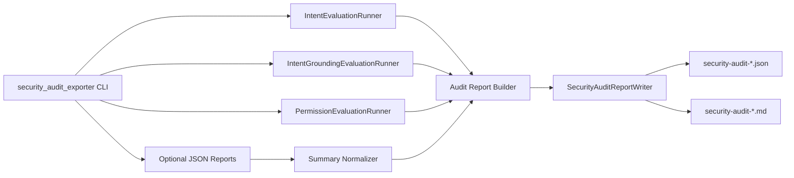

# v1.3 安全审计报告导出设计

## 背景

v1.2 已经把数据权限评测接入基础 CI 和真实 Qwen 质量门禁。项目现在具备三层安全治理、确定性权限回归、真实评测 quality gate 和完整测试矩阵，但这些证据分散在 README、各类 evaluation 报告、quality gate 输出和工作日志中。

v1.3 的目标不是新增一层安全策略，而是把现有安全能力整理成一份可复用、可自动生成、可面试展示的安全审计报告。报告应证明这个 Agent 不只是能生成 SQL，还能在 LLM 调用前、SQL 执行前、权限检查前后都留下可验证证据。

## 目标

1. 新增后端 CLI：`python -m evaluation.security_audit_exporter`。
2. 输出 JSON 和 Markdown 两种报告：
   - JSON 用于自动化、后续 CI artifact 和测试断言。
   - Markdown 用于 README、面试演示和人工审阅。
3. 聚合现有安全证据：
   - Intent Guard 危险意图评测摘要。
   - NL2SQL 安全预期与危险请求阻断摘要。
   - SQL Repair 端到端修复摘要。
   - Result Correctness 摘要。
   - Intent Grounding 摘要。
   - Data Permission Guard 权限评测摘要。
   - Quality Gate 检查结果。
4. 不调用真实 LLM，不连接真实数据库，不依赖 GitHub Actions 环境。
5. 不输出完整权限策略表达式、密钥、环境变量值或用户敏感数据。

## 非目标

1. 不修改 Data Permission Guard 的授权语义。
2. 不调整现有 quality gate 阈值。
3. 不新增前端页面。前端安全审计面板增强留给 v1.4。
4. 不强制在基础 CI 生成审计报告。CI artifact 接入可作为后续小版本。
5. 不把历史 `backend/evaluation/reports/` 中的旧报告作为唯一输入来源，避免本地历史文件影响测试稳定性。

## 推荐方案

采用“确定性现跑 + 可选外部报告输入”的组合：

- 默认模式下，CLI 运行不依赖 LLM 和数据库的确定性评测：
  - `IntentEvaluationRunner`
  - `IntentGroundingEvaluationRunner`
  - `PermissionEvaluationRunner`
- 对真实 Qwen 相关摘要，CLI 支持通过参数传入已有报告：
  - `--nl2sql-report`
  - `--repair-report`
  - `--correctness-report`
  - `--quality-gate-report`
- 如果真实评测报告未传入，Markdown 中明确标记为“未提供”，JSON 中保留 `provided=false`，不把缺失误写成 0 分。

这个方案让本地面试演示可以快速生成安全审计报告，也让后续 CI 可以把真实 Qwen 评测结果拼进同一份审计材料。

## CLI 设计

命令：

```bash
cd backend
python -m evaluation.security_audit_exporter --write-report
```

参数：

| 参数 | 必填 | 说明 |
|---|---:|---|
| `--write-report` | 否 | 写入 Markdown 和 JSON 报告。 |
| `--json` | 否 | 向 stdout 输出完整 JSON。 |
| `--output-dir` | 否 | 报告输出目录；默认复用 `EVALUATION_REPORT_DIR`，否则写入 `backend/evaluation/reports/`。 |
| `--timestamp` | 否 | 测试和 CI 可传固定时间戳，保证文件名稳定。 |
| `--nl2sql-report` | 否 | 真实 NL2SQL 评测 JSON 报告路径。 |
| `--repair-report` | 否 | SQL Repair 评测 JSON 报告路径。 |
| `--correctness-report` | 否 | 结果正确性评测 JSON 报告路径。 |
| `--quality-gate-report` | 否 | 质量门禁 JSON 报告路径。 |
| `--fail-on-missing-real-reports` | 否 | 严格模式：真实评测报告缺失时返回非 0。默认不启用，方便本地演示。 |

退出码：

- `0`：确定性安全审计通过，且严格模式下所需输入完整。
- `1`：确定性安全审计失败，或 quality gate 报告显示未通过。
- `2`：输入文件不存在、JSON 格式错误或 summary/checks 结构非法。

## 报告结构

JSON 顶层结构：

```json
{
  "summary": {
    "passed": true,
    "deterministic_security_passed": true,
    "real_evaluation_provided": false,
    "quality_gate_provided": false,
    "missing_real_reports": ["nl2sql", "repair", "correctness"],
    "risk_count": 0
  },
  "sections": {
    "intent_guard": {},
    "nl2sql_safety": {},
    "sql_repair": {},
    "result_correctness": {},
    "intent_grounding": {},
    "data_permission": {},
    "quality_gate": {}
  },
  "evidence": [
    {
      "id": "permission.row_filter",
      "title": "Analyst 订单查询自动注入行级过滤",
      "status": "passed",
      "source": "PermissionEvaluationRunner"
    }
  ],
  "risks": []
}
```

Markdown 报告结构：

1. `# 安全审计报告`
2. 总览：通过状态、生成时间、真实评测输入是否完整。
3. 安全证据矩阵：
   - Intent Guard
   - SQL Guard / NL2SQL Safety
   - SQL Repair
   - Result Correctness
   - Intent Grounding
   - Data Permission Guard
   - Quality Gate
4. 关键演示证据：
   - 危险意图在 LLM 前阻断。
   - 危险 SQL 不进入执行。
   - 权限越权字段被阻断。
   - analyst 订单查询被行级过滤改写。
   - quality gate 对核心指标执行 100% 阈值。
5. 缺失输入和风险说明：
   - 未传真实评测报告时，不判定失败，但明确提示“本报告未包含真实 Qwen 端到端结果”。

## 模块设计

新增文件：

| 文件 | 责任 |
|---|---|
| `backend/evaluation/security_audit_exporter.py` | CLI 入口和审计报告聚合逻辑。 |
| `backend/evaluation/security_audit_report_writer.py` | JSON/Markdown 写入器。 |
| `backend/tests/test_security_audit_exporter.py` | 聚合逻辑、CLI 参数和退出码测试。 |
| `backend/tests/test_security_audit_report_writer.py` | 报告写入和 Markdown 内容测试。 |

复用现有模块：

- `evaluation.intent_evaluator.IntentEvaluationRunner`
- `evaluation.intent_grounding_evaluator.IntentGroundingEvaluationRunner`
- `evaluation.permission_evaluator.PermissionEvaluationRunner`
- `evaluation.quality_gate.evaluate_quality` 的输出结构作为可选输入，不在 exporter 内重复实现质量门禁规则。

## 数据流



## 错误处理

1. 可选报告路径传入但文件不存在：返回 `2`，stderr 输出路径错误。
2. JSON 无法解析：返回 `2`。
3. JSON 缺少 `summary` 或 quality gate 缺少 `checks`：返回 `2`。
4. 确定性评测失败：返回 `1`，报告中保留失败 case 和风险说明。
5. 未传真实评测报告：
   - 默认返回码不因此失败。
   - `--fail-on-missing-real-reports` 启用时返回 `1`。

## 测试策略

1. TDD 先写 exporter 测试：
   - 无真实报告时能生成完整 JSON，且 `real_evaluation_provided=false`。
   - 传入 fake NL2SQL / repair / correctness / quality gate 报告后能聚合摘要。
   - 缺失路径返回 `2`。
   - deterministic permission 失败会使 summary `passed=false`。
2. Writer 测试：
   - 同时写 JSON 和 Markdown。
   - Markdown 包含安全证据矩阵和关键演示证据。
   - Markdown 不包含完整行级策略表达式、密钥形态或环境变量值。
3. CLI 测试：
   - `--json` 输出完整 JSON。
   - `--write-report --timestamp ci` 生成稳定文件名。
4. 最终验证：
   - `pytest tests/test_security_audit_exporter.py tests/test_security_audit_report_writer.py -q`
   - `pytest tests/test_permission_evaluator.py tests/test_quality_gate.py tests/test_workflow_files.py -q`
   - `pytest -q`

## README 与工作日志

README 增加一节 `v1.3 安全审计报告导出`：

```bash
cd backend
python -m evaluation.security_audit_exporter --write-report
```

说明报告用途：

- 本地面试演示。
- 版本交付审计。
- 后续 CI artifact 和前端审计面板的数据来源。

工作日志记录 v1.3 的设计、实现、验证结果和下一步 v1.4 前端审计面板增强。

## 验收标准

1. CLI 可在无 Qwen API、无数据库服务的环境下生成安全审计报告。
2. 报告中明确区分“已验证通过”和“未提供真实评测输入”。
3. 权限相关证据只展示规则 ID、表名和状态，不展示完整策略表达式。
4. 测试覆盖正常路径、缺失输入、非法 JSON、报告写入和 CLI 输出。
5. README 有可直接复制的命令和面试用途说明。
6. 全量后端测试通过，且没有新增 secret scan 或 placeholder 风险。
