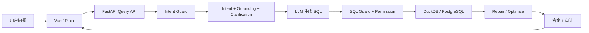

# 第1章 项目目标与完整架构

> 本章预计 1～2 小时。先建立全局地图，再进入局部代码；第一次学习只读代码，不调用真实 LLM。

## 1.1 学习目标

> 完成本章后，你应能区分 Data Analyst、NL2SQL 与受控 Agent；从 `/api/chat/query` 追踪到 AgentGraph、数据库执行和 `QueryResponse`；画出三类不确定性与三层确定性治理。

## 1.2 前置知识

> 只要求知道 Python 函数会接收参数并返回结果、HTTP POST 用来提交数据、SQL `SELECT` 用来查询表。遇到不认识的框架语法先关注“输入—调用—输出”，不用一开始理解全部实现。

## 1.3 为什么需要这一模块

> Data Analyst 解决的是“业务问题如何变成指标、维度、筛选与结论”；NL2SQL 只解决其中“自然语言如何变成 SQL”；Agent 则把理解、澄清、生成、校验、执行、修复与解释编排成可恢复流程。
>
> 这个项目不是把问题直接发给模型。模型可能误解业务词、生成危险 SQL、引用不存在的列或只返回 reasoning 而没有 content，所以系统必须在模型前后加入确定性规则，并保留审计证据。

## 1.4 输入、输出与依赖

| 边界 | 主要输入 | 主要输出 | 是否可能调用 LLM |
|---|---|---|---|
| Vue 工作台 | 问题、会话、澄清选择 | 页面状态与结果面板 | 否 |
| Query API | `QueryRequest`、身份 | `SuccessResponse[QueryResponse]` 或 SSE | 否 |
| AgentGraph | 问题、用户、会话状态 | 最终 Agent State | 部分节点会 |
| Guard/权限 | 意图、候选 SQL、身份 | 放行、阻断或授权后 SQL | 否 |
| 数据库 | 已授权只读 SQL | 列、行、耗时或错误 | 否 |
| 答案生成 | 问题与结构化结果 | 自然语言解释 | 会 |

> `QueryResponse` 不只有答案，还包含 `status`、`sql`、`columns`、`rows`、`retry_count`、`analysis_intent`、`clarification` 和 `audit_report`。这说明产品把“结果”和“如何得到结果的证据”一起返回。

## 1.5 执行流程



> 三类不确定性分别是语言理解、模型生成与外部依赖；对应治理是结构化 Intent/澄清、SQL AST/权限、超时/重试/失败隔离。Repair 只在执行失败且仍有重试预算时回流，阻断和澄清不会访问数据库。

## 1.6 当前代码地图

| 阅读顺序 | 文件 | 先找什么 |
|---|---|---|
| 1 | `backend/app/main.py` | 应用、生命周期、中间件、路由注册 |
| 2 | `backend/app/api/query.py` | `query()` 如何准备输入并调用图 |
| 3 | `backend/app/agents/graph.py` | 12 个节点、条件边和终止点 |
| 4 | `backend/app/agents/state.py` | 节点共享字段 |
| 5 | `backend/app/db/query_runner.py` | SQL 怎样执行并返回结构化结果 |
| 6 | `backend/app/models/schemas.py` | API 最终对外字段 |
| 7 | `frontend/src/stores/query.js` | 页面如何保存请求生命周期 |
| 8 | `frontend/src/views/Home.vue` | 各结果面板如何组合 |

> 推荐采用“入口—契约—编排—实现—测试”的顺序，而不是按文件夹字母顺序阅读。测试通常最直接地表达一个模块允许和拒绝什么。

## 1.7 关键代码理解

### 1.7.1 应用入口不是业务入口

> `backend/app/main.py` 创建 FastAPI、初始化目录与追踪、配置 CORS 和限流，再注册 health、schema、query、auth 四组路由。它负责组装，不负责生成 SQL。

```python
app.include_router(health.router)
app.include_router(schema.router)
app.include_router(query.router)
app.include_router(auth_router.router)
```

### 1.7.2 查询入口是边界层

> `query()` 接收已经通过 Pydantic 校验的 `QueryRequest`，取得可选身份，决定缓存条件，构建 Agent 输入，并把内部状态转换成稳定响应。路由层不应自行拼 SQL。

### 1.7.3 图是业务编排层

> 当前图有 12 个节点：`check_intent`、`parse_intent`、`ground_schema`、`assess_clarification`、`load_schema`、`generate_sql`、`validate_sql`、`authorize_sql`、`execute_sql`、`repair_sql`、`optimize_sql`、`generate_answer`。记住节点职责比背代码行号更重要。
>
> 关键终止路径有四类：危险意图阻断、需要澄清、SQL/权限/执行最终失败、正常生成答案。面试时能够解释“什么时候不调用模型、什么时候不访问数据库”比只会画直线流程更有价值。

### 1.7.4 确定性边界包围 LLM

> Intent Guard 在任何 LLM/DB 调用前阻断明显危险请求；SQL Guard 在生成后解析 AST；Permission 在执行前根据用户重写或拒绝 SQL；Sandbox、LIMIT 和 timeout 约束数据库资源。这些层不能被 Prompt 替代。

## 1.8 最小动手运行

> 工作目录：项目根目录。网络/真实模型：不需要。下面只验证应用健康契约，不证明完整查询链路。

```bash
pytest backend/tests/test_health.py -q
```

> 然后进行一次只读导航：在编辑器中依次搜索 `@router.post("/api/chat/query")`、`get_agent_graph`、`workflow.add_node`、`QueryResponse`。把每次跳转的文件名和职责写在纸上。

## 1.9 故障注入实验

> 可恢复故障：切换到 `backend` 目录后故意执行根目录形式的测试路径，记录“路径不存在”或导入错误；再回到项目根目录运行正确命令。不要修改 `sys.path` 或源码来掩盖工作目录错误。

```powershell
Set-Location backend
pytest backend/tests/test_health.py -q
Set-Location ..
pytest backend/tests/test_health.py -q
```

## 1.10 调试路径与常见误判

| 现象 | 先检查 | 不能直接得出的结论 |
|---|---|---|
| 首页能打开 | 前端静态资源 | 后端与模型正常 |
| `/health` 成功 | FastAPI 进程 | readiness、数据库和 Agent 正常 |
| SQL 可执行 | SQL 语法 | 业务口径正确 |
| 收到 SSE progress | 流连接与部分节点 | 最终查询成功 |
| Repair 通过 | 指定损坏 SQL 被修复 | 所有 NL2SQL 样例正确 |

> 调试时先给故障归层：浏览器、API、图节点、LLM、Guard/权限、数据库或展示。没有证据前不要随机改 Prompt。

## 1.11 独立编码练习

> 不修改生产代码，创建自己的学习笔记并完成三项内容：十行以内模块职责清单；标出 12 个节点中哪些调用 LLM；为“删除所有订单”与“统计各地区销售额”分别画出终止路径。

## 1.12 测试或评测验证

> 阅读 `backend/tests/test_health.py` 中 readiness 的测试名称。它能证明数据库检查、业务表完整性和 secure profile fail-closed 等行为；它不能证明 LLM 可用、SQL 语义正确或前端可用。

> 验收标准：你能说出测试对象、替身/依赖、核心断言和未覆盖边界，而不只说“测试绿了”。

## 1.13 面试复述题

> 1. 为什么这个项目不是一个“让大模型写 SQL”的简单套壳？
>
> 2. 哪些节点必须是确定性的，为什么？
>
> 3. 一条问题在哪些情况下会在访问数据库前结束？

## 1.14 掌握度检查与下一章

> 不看文档画出主链路；说出 12 个节点中至少 8 个及其顺序；解释 `/health` 与完整 Agent 验收的差别。三项都能完成再进入第2章。
