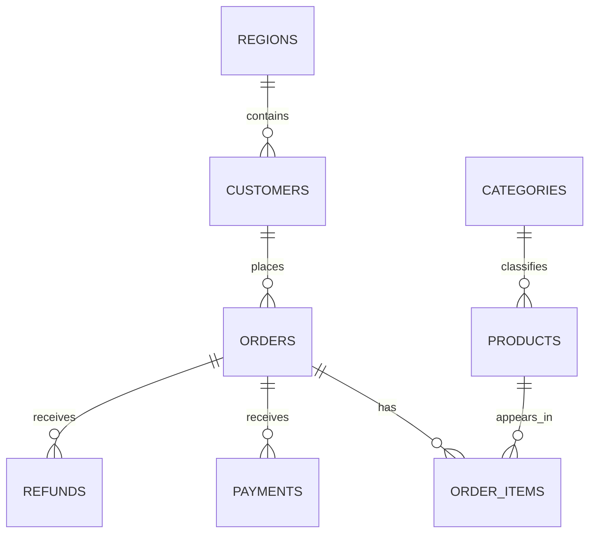

# 第3章 SQL、DuckDB 与电商业务模型

> 本章预计 1～2 小时，建立 Agent 最终查询的数据世界。种子数据命令会重建演示库，运行前确认没有把个人数据放进项目演示数据库。

## 3.1 学习目标

> 能解释八张表的主外键与粒度；手写 JOIN、过滤、聚合、分组、排序；识别一对多 JOIN 的重复聚合；说明 DuckDB 演示库与 PostgreSQL 适配的边界。

## 3.2 前置知识

> 需要了解 `SELECT`、`FROM`、`WHERE`、`GROUP BY` 和 `SUM/COUNT`。不熟悉 JOIN 时，先把它理解为“按键把两张表的相关行拼到一起”。

## 3.3 为什么需要这一模块

> 模型可以生成语法完全合法却业务错误的 SQL。销售额可能来自订单总额、明细单价×数量或实际支付金额；退款率的分母也可能是订单数、支付额或销售额。没有业务口径，就不存在唯一的“正确 SQL”。
>
> 数据粒度是判断重复的核心：`orders` 一行一个订单，`order_items` 一行一个订单商品，`payments` 一行一次支付，`refunds` 一行一次退款。把多个一对多表直接连接，行数可能相乘。

## 3.4 输入、输出与依赖

| 表 | 一行代表 | 主键 | 主要外键/用途 |
|---|---|---|---|
| `regions` | 一个地区 | `region_id` | 客户地域 |
| `customers` | 一个客户 | `customer_id` | `region_id` |
| `categories` | 一个商品类别 | `category_id` | 商品分类 |
| `products` | 一个商品 | `product_id` | `category_id`、价格、成本 |
| `orders` | 一个订单 | `order_id` | `customer_id`、日期、状态、订单金额 |
| `order_items` | 一个订单明细 | `item_id` | `order_id`、`product_id`、数量、成交单价 |
| `payments` | 一笔支付 | `payment_id` | `order_id`、支付状态、实付金额 |
| `refunds` | 一笔退款 | `refund_id` | `order_id`、退款金额与日期 |

> SQL 的输入是表、字段和业务口径，输出是有明确列名与粒度的结果集。项目默认使用 DuckDB 本地文件；配置也支持 PostgreSQL，但方言、连接生命周期、隔离与迁移策略不能假定完全相同。

## 3.5 执行流程



> 从业务问题拆 SQL 的固定顺序是：确定结果粒度 → 指标表达式 → 维度 → 时间字段 → 状态/范围筛选 → 必要 JOIN → 排序与 LIMIT。

## 3.6 当前代码地图

| 内容 | 路径 | 阅读目的 |
|---|---|---|
| 建表 DDL | `database/init.sql` | 字段、主键、外键与类型 |
| 种子脚本 | `database/seed_data.py` | 数据量、事务和可重复初始化 |
| 设计说明 | `docs/database_design_md.md` | 业务关系与样例 |
| 连接层 | `backend/app/db/connection.py` | DuckDB/PostgreSQL 选择 |
| 黄金结果 | `backend/evaluation/cases/golden_result_cases.yaml` | 如何证明结果语义 |
| 种子测试 | `backend/tests/test_seed_data.py` | 幂等与失败回滚 |

## 3.7 关键代码理解

### 3.7.1 先确定粒度

> “各类别销售额”要求一行一个类别。连接链是 categories→products→order_items；指标可定义为 `quantity * unit_price`。如果口径要求只统计已完成订单，还要连接 orders 并筛选状态。

```sql
SELECT
  c.category_name,
  SUM(oi.quantity * oi.unit_price) AS sales_amount
FROM categories AS c
JOIN products AS p ON p.category_id = c.category_id
JOIN order_items AS oi ON oi.product_id = p.product_id
JOIN orders AS o ON o.order_id = oi.order_id
WHERE o.order_date >= DATE '2024-01-01'
  AND o.order_date < DATE '2025-01-01'
  AND o.status = 'completed'
GROUP BY c.category_name
ORDER BY sales_amount DESC;
```

> 半开时间区间 `>= 起点 AND < 下一周期起点` 比对时间戳使用 `BETWEEN` 更不容易漏掉年末带时分秒的数据。

### 3.7.2 识别重复聚合

> 一个订单若有 3 条明细和 2 笔支付，直接连接后可能产生 6 行。此时 `SUM(paid_amount)` 会重复。常见解决方案是先把支付按订单聚合，再连接订单；是否需要这样做取决于问题粒度和表的实际约束。

```sql
WITH paid_by_order AS (
  SELECT order_id, SUM(paid_amount) AS paid_amount
  FROM payments
  WHERE payment_status = 'success'
  GROUP BY order_id
)
SELECT o.order_id, p.paid_amount
FROM orders AS o
JOIN paid_by_order AS p ON p.order_id = o.order_id;
```

### 3.7.3 NULL、COUNT 与除零

> `COUNT(*)` 统计行，`COUNT(column)` 忽略 NULL，`COUNT(DISTINCT order_id)` 去重订单。比例计算应使用 `NULLIF(denominator, 0)` 防止除零，并明确结果是 0、NULL 还是无数据。

### 3.7.4 DuckDB 与 PostgreSQL

> 当前 SQL 生成以 DuckDB 方言为主，本地文件便于演示和固定评测。PostgreSQL 更适合服务端并发与迁移，但要额外考虑连接池、事务、权限、schema、超时和方言。不能只把 URL 换掉就宣称生产就绪。

## 3.8 最小动手运行

> 工作目录：项目根目录。网络/真实模型：不需要。第一条命令会重建项目演示数据；若只想验证逻辑，可仅运行测试，测试使用临时数据库。

```bash
python -m database.seed_data
pytest backend/tests/test_seed_data.py -q
```

> 注意项目正式入口是模块形式 `python -m database.seed_data`，不要用过时的脚本路径假定包导入一定成功。

## 3.9 故障注入实验

> 在个人 SQL 客户端或临时查询中运行一个缺少 JOIN 条件的版本，比较 `COUNT(*)` 与 `COUNT(DISTINCT o.order_id)`；随后恢复 JOIN 条件。实验只读，不修改种子数据。

```sql
SELECT COUNT(*) AS joined_rows,
       COUNT(DISTINCT o.order_id) AS distinct_orders
FROM orders AS o
CROSS JOIN order_items AS oi;
```

> 预期 joined_rows 明显大于订单数。真正的故障证据是粒度变化，而不是“查询有没有报错”。

## 3.10 调试路径与常见误判

> SQL 结果异常时按以下顺序：确认期望粒度；分别统计各表行数；只保留主表；逐个加入 JOIN 并统计行数；最后加入聚合和筛选。这样能定位是哪条连接放大或缩小数据。

| 误判 | 更可靠的检查 |
|---|---|
| SQL 能执行，所以答案正确 | 与黄金查询/结果比较 |
| `orders.total_amount` 永远等于实付 | 核对支付状态、退款与业务口径 |
| JOIN 越多信息越完整 | 检查每次 JOIN 的基数 |
| 没有结果就是模型错 | 检查时间范围、状态值、NULL 与种子数据 |

## 3.11 独立编码练习

> 写三条只读 SQL：2024 年各类别已完成订单销售额；各地区支付成功金额；退款订单占有支付订单的比例。每条先写“结果一行代表什么”，再写 SQL，并解释为什么没有重复计算。

## 3.12 测试或评测验证

> 阅读 `golden_result_cases.yaml`，选择一例写出黄金 SQL 的粒度、排序与比较规则。结果正确性比执行成功更严格，因为它验证业务输出，而不是只验证数据库接受语法。

> 验收命令工作目录为项目根目录，不需要网络或真实模型：

```bash
pytest backend/tests/test_seed_data.py backend/tests/test_result_correctness_evaluator.py -q
```

## 3.13 面试复述题

> 1. 为什么 orders、order_items 与 payments 直接 JOIN 可能重复金额？
>
> 2. SQL 可执行、SQL 语义正确和业务口径正确有什么区别？
>
> 3. DuckDB 与 PostgreSQL 在本项目中分别承担什么角色？

## 3.14 掌握度检查与下一章

> 能不看图画出八表关系；先说粒度再写 SQL；用行数证据定位 JOIN 放大。完成后进入环境、配置与调试。
