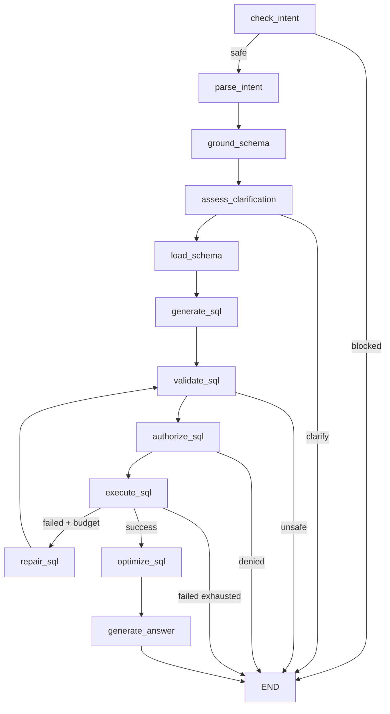

# 第12章 LangGraph 状态、节点与路由

> 本章预计 2 小时，建立完整 Agent 状态机。重点是可控路由，不是追求“自主运行”。

## 12.1 学习目标

> 能画出12节点、5组条件边、终止点与 Repair 回流；能区分 State 契约、节点局部更新和路由函数；能追踪 progress 与 audit。

## 12.2 前置知识

> 需要理解 Intent、Grounding、Schema、SQL、权限和结构化执行结果。

## 12.3 为什么需要这一模块

> 线性函数难以清晰表达安全阻断、主动澄清、权限拒绝、执行修复和答案降级。StateGraph 把“做什么”和“下一步去哪”分开，使每条关键路径可注入依赖并测试。

## 12.4 输入、输出与依赖

> `AgentState` 是 TypedDict：它约定字段但不做完整运行时校验。图节点读取所需字段并返回局部更新；进入 Intent 业务逻辑前会用 Pydantic 重新校验。最终 State 再转换为 API 模型。

| 字段组 | 代表字段 |
|---|---|
| 请求/会话 | question、session_id、conversation_context |
| Intent | intent_is_safe、analysis_intent、grounding_result、clarification_request |
| SQL | generated_sql、validated_sql、is_sql_safe、permission_allowed |
| 执行 | execution_success、query_result、execution_error、retry_count |
| 输出/证据 | answer、answer_error、optimization_suggestions、audit_events、llm_calls |

## 12.5 执行流程



## 12.6 当前代码地图

| 内容 | 路径 |
|---|---|
| State | `backend/app/agents/state.py` |
| Graph | `backend/app/agents/graph.py` |
| Progress | `backend/app/agents/progress_notifier.py` |
| Audit | `backend/app/agents/audit.py` |
| 图测试 | `backend/tests/test_agent_graph.py` |

## 12.7 关键代码理解

### 12.7.1 五个决策点

> Intent Guard 决定 parse/end；澄清决定 load/end；SQL Guard 决定 authorize/end；Permission 决定 execute/end；执行结果决定 optimize/repair/end。危险 SQL 和越权 SQL都不能进入 Repair。

### 12.7.2 Repair 必须回到 validate_sql

> 修复结果仍来自 LLM，不能直接执行。回流后会重新 AST 校验、自动 LIMIT、权限检查，再执行。这条边是安全不变量。

### 12.7.3 初始值避免上一请求污染

> `run()` 为所有字段建立新初始 State，读取历史摘要但不复用上一轮字典。LLM trace 也在请求开始时重置，审计在图完成后汇总。

### 12.7.4 Progress 与图解耦

> progress callback 作为 state 中的内部字段注入，独立 notifier 同时支持同步/异步回调，并吞掉回调自身异常。UI 进度失败不应破坏查询主流程。

## 12.8 最小动手运行

> 工作目录：项目根目录。网络/真实模型：不需要，测试必须注入 Fake LLM/Runner。

```bash
pytest backend/tests/test_agent_graph.py backend/tests/test_progress_notifier.py -q
```

## 12.9 故障注入实验

> 让 Fake Runner 第一次返回未知列错误、Repair 返回安全 SQL，确认路径 execute→repair→validate→authorize→execute；再让 Repair 返回 DELETE，确认第二次 validate 后终止。

## 12.10 调试路径与常见误判

> 先看最终 status 和 audit 的最后事件，再看对应条件函数输入。字段存在不代表本轮有效；例如 generated_sql 存在但 is_sql_safe=false 时绝不能执行。不要通过手工跳节点修测试。

## 12.11 独立编码练习

> 画一个五节点 MiniGraph：guard→generate→validate→execute→answer，加入 unsafe 终止和一次 repair 回流。为三条路径写状态断言。

## 12.12 测试或评测验证

> 找出成功、Intent 阻断、澄清、SQL 阻断、权限阻断、Repair 成功、重试耗尽、答案降级八条路径。验证“没被调用的依赖”与返回字段同样重要。

## 12.13 面试复述题

> 1. LangGraph 的价值是更自主还是更可控？
>
> 2. 为什么条件边比节点内部直接调用下一节点更易测试？
>
> 3. 哪三类失败不能进入 Repair？

## 12.14 掌握度检查与下一章

> 能不看源码画出12节点与5个决策点；能用 State 证据解释一条失败路径。下一章学习 Repair、优化和多轮。
