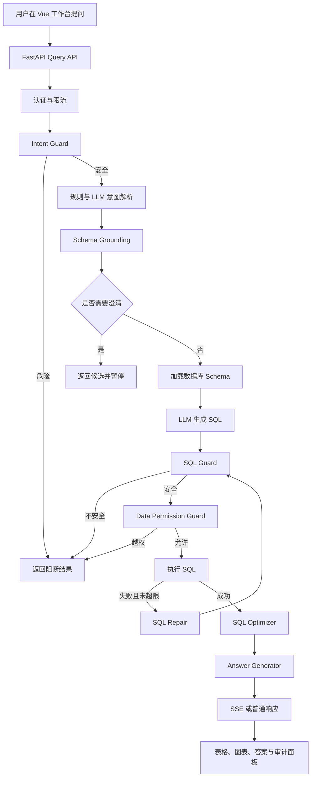

# 第一章 认识 Data Analyst Agent

> 本章对应项目版本 `v1.7`。本章最后核对日期为 2026-07-11。

## 1.1 本章目标

> 完成本章后，你应该能够：
>
> 1. 用自己的话说明 Data Analyst Agent 解决了什么问题；
> 2. 区分普通数据查询工具、NL2SQL 和受控 Agent 工作流；
> 3. 画出用户问题从前端到数据库再返回答案的完整路径；
> 4. 说出前端、后端、数据库、LLM 和测试体系各自的职责；
> 5. 找到项目入口、工作流入口和最小验证命令。

## 1.2 问题场景

> 假设运营同事想知道“统计 2024 年每个月的销售额”。传统做法通常需要把需求交给数据分析师，由分析师确认销售额口径、找到订单表、编写 SQL、执行查询，再把结果整理成图表和文字。
>
> Data Analyst Agent 希望把这条路径变成一次自然语言交互。用户只描述问题，系统负责理解指标和维度、映射真实表字段、生成 SQL、安全校验、权限检查、查询执行和结果解释。

```text
用户问题：统计 2024 年每个月的销售额

期望输出：
- 系统理解“销售额”是一个业务指标；
- 系统理解“每个月”是时间维度；
- 系统只查询 2024 年数据；
- 系统生成 DuckDB 方言的只读 SQL；
- 系统返回月度数据、文字结论和图表；
- 系统保留安全、权限和执行证据。
```

> 难点不只是“让模型写出一条 SQL”。数据库字段可能与业务用语不同，模型可能引用不存在的列，用户可能提出危险操作，角色可能无权查看敏感字段，SQL 也可能在执行时失败。项目的深度主要来自对这些不确定性的控制。

## 1.3 什么是 Data Analyst Agent

### 1.3.1 Data Analyst

> Data Analyst 表示系统面向数据分析任务，而不是通用聊天。它关注指标、维度、筛选、排序、排名、时间范围、数据权限和结果解释。

### 1.3.2 NL2SQL

> NL2SQL 是 Natural Language to SQL 的缩写，即把自然语言转换为 SQL。NL2SQL 只是整个系统的一段能力：它负责得到查询语句，但不会自动保证业务口径、安全、权限、执行成功和结果正确。

### 1.3.3 Agent

> 本项目中的 Agent 更准确地说是“受控工作流 Agent”。LangGraph 提前定义节点和条件边，LLM 只在意图补充、SQL 生成、SQL 修复和答案生成等明确位置参与。安全、权限、重试次数和路由由确定性代码控制。
>
> 这种设计不会追求完全自主。数据查询涉及真实数据库和敏感信息，越重要的安全边界越不应该只依赖模型自行判断。

| 类型 | 主要行为 | 优点 | 局限 |
|---|---|---|---|
| 固定报表 | 点击预设筛选项 | 稳定、容易治理 | 不能灵活回答新问题 |
| 直接 NL2SQL | 问题直接交给 LLM 生成 SQL | 实现简单 | 容易出现幻觉、安全和权限风险 |
| 受控 Agent 工作流 | LLM 节点与确定性节点协作 | 可解释、可阻断、可修复、可评测 | 模块更多，需要维护状态和契约 |

## 1.4 完整执行流程

> 当前后端在 `backend/app/agents/graph.py` 中注册 12 个 LangGraph 节点。用户问题进入图以后，不会直接到 SQL Generator，而会先经过身份和危险意图边界，再进入意图解析和 Schema Grounding。



> 这张图中有三个必须记住的闭环：
>
> 1. 危险意图在调用 LLM 和数据库之前结束；
> 2. 修复后的 SQL 必须重新经过 SQL Guard 和权限检查；
> 3. 只有执行成功的查询结果才能进入答案生成。

## 1.5 技术栈如何分工

| 层级 | 主要技术 | 在项目中的职责 |
|---|---|---|
| 浏览器界面 | Vue 3、Element Plus、Pinia、ECharts | 收集问题，显示进度、答案、SQL、表格、图表和审计信息 |
| HTTP API | FastAPI、Pydantic | 定义接口、校验请求响应、组织认证和错误边界 |
| Agent 编排 | LangGraph | 管理共享状态、节点顺序、条件分支和修复循环 |
| LLM 接口 | httpx、OpenAI-compatible API | 解析部分意图、生成 SQL、修复 SQL、生成文字答案 |
| SQL 安全 | SQLGlot | 解析 SQL AST，限制语句、对象、函数和返回行数 |
| 数据库 | DuckDB、可选 PostgreSQL | 保存电商数据并执行只读分析 SQL |
| 测试评测 | pytest、Vitest、Playwright、自定义 Evaluator | 验证代码、浏览器流程、准确性、安全性和质量门禁 |
| 部署 | Docker、Nginx、GitHub Actions | 构建、启动、代理和持续验证完整应用 |

## 1.6 项目目录

> 先记住目录的职责，不需要在第一章读完其中所有文件。

```text
data_analyst_agent/
├── backend/
│   ├── app/
│   │   ├── agents/           # Agent 节点、状态和工作流
│   │   ├── analysis_intent/  # 结构化分析意图
│   │   ├── api/              # FastAPI 路由
│   │   ├── db/               # 数据库连接、Schema 和查询执行
│   │   ├── schema_context/   # 元数据目录
│   │   ├── security/         # 意图、SQL、身份和数据权限
│   │   ├── semantic/         # 指标、维度和 JOIN 语义
│   │   └── services/         # LLM、缓存、追踪和实验
│   ├── evaluation/           # 评测器、用例和报告
│   └── tests/                # 后端自动化测试
├── database/                 # 表结构与种子数据
├── frontend/                 # Vue 工作台和前端测试
├── docs/                     # 设计、计划、报告和求职材料
├── scripts/                  # 预检、证据和安全脚本
└── user_docs/                # 面向学习者的课程材料
```

## 1.7 代码地图

| 想理解的问题 | 从哪里开始 | 继续阅读 |
|---|---|---|
| FastAPI 如何启动 | `backend/app/main.py` | `backend/app/api/` |
| Agent 有哪些节点 | `backend/app/agents/graph.py` | `backend/app/agents/state.py` |
| 请求响应有什么字段 | `backend/app/models/schemas.py` | `backend/app/api/query.py` |
| 数据库有哪些表 | `database/init.sql` | `docs/database_design_md.md` |
| 前端页面从哪里进入 | `frontend/src/main.js` | `frontend/src/App.vue`、`frontend/src/views/Home.vue` |
| 核心行为如何验证 | `backend/tests/` | `frontend/tests/`、`frontend/e2e/` |

## 1.8 阅读项目入口代码

### 1.8.1 FastAPI 入口

```python
app = FastAPI(
    title="Data Analyst Agent",
    description="自然语言驱动的数据库分析与 SQL 优化系统",
    version="1.0.0",
    lifespan=lifespan,
)

setup_rate_limit(app)
app.include_router(health.router)
app.include_router(schema.router)
app.include_router(query.router)
app.include_router(auth_router.router)
```

> `app` 是后端 HTTP 应用对象。`lifespan` 处理启动和关闭阶段，`setup_rate_limit` 注册限流，四个 router 分别提供健康检查、Schema、查询和认证接口。
>
> 入口文件只负责组装，不应该包含 SQL 生成或数据库分析细节。这样每个业务模块才能独立测试和替换。

### 1.8.2 LangGraph 节点注册

```python
workflow.add_node("check_intent", self._check_intent)
workflow.add_node("parse_intent", self._parse_intent)
workflow.add_node("ground_schema", self._ground_schema)
workflow.add_node("assess_clarification", self._assess_clarification)
workflow.add_node("load_schema", self._load_schema)
workflow.add_node("generate_sql", self._generate_sql)
workflow.add_node("validate_sql", self._validate_sql)
workflow.add_node("authorize_sql", self._authorize_sql)
workflow.add_node("execute_sql", self._execute_sql)
workflow.add_node("repair_sql", self._repair_sql)
workflow.add_node("optimize_sql", self._optimize_sql)
workflow.add_node("generate_answer", self._generate_answer)
```

> `add_node` 只是把名字和函数注册到图中。节点是否执行、先后顺序和失败后去哪里，还需要普通边和条件边决定。第十一章会完整拆解这张图。

## 1.9 确定性代码和 LLM 的边界

> 判断一个模块是否应该交给 LLM，可以先问两个问题：结果是否允许随机变化，错误是否会造成真实风险。

| 能力 | 主要执行者 | 原因 |
|---|---|---|
| 识别明确危险词和凭据请求 | 确定性规则 | 必须稳定阻断，不能依赖模型心情 |
| 从自然语言补充复杂分析意图 | LLM | 语言表达多样，纯规则难以覆盖 |
| 校验 SQL 类型和危险函数 | SQLGlot AST | 需要可重复、可测试的结构判断 |
| 生成候选 SQL | LLM | 需要结合问题和 Schema 进行推理 |
| 数据权限和行级过滤 | 确定性策略 | 权限不能交给模型自行决定 |
| 把查询结果写成自然语言 | LLM | 需要表达和总结能力 |

## 1.10 动手验证

### 1.10.1 检查项目入口能否导入

```bash
cd backend
python -c "from app.main import app; print(app.title)"
```

> 预期输出包含 `Data Analyst Agent`。这一步不调用真实 LLM，但会加载后端模块和配置，能够发现 Python 依赖、导入路径和语法错误。

### 1.10.2 运行健康检查测试

```bash
pytest backend/tests/test_health.py -q
```

> 验收标准不是固定的测试数量，而是命令退出码为 0，所有用例通过。该测试覆盖 readiness、数据库可用性、监控端点认证和管理接口权限。

### 1.10.3 观察测试而不是只观察实现

> 打开 `backend/tests/test_health.py`，找到 `test_readiness_failure_hides_database_error`。它证明数据库错误中即使包含疑似密码，API 也只向外返回稳定的“服务未就绪”，不会把底层异常原样泄露。

## 1.11 常见错误

### 1.11.1 在项目根目录直接导入 `app`

```text
ModuleNotFoundError: No module named 'app'
```

> `app` 包位于 `backend/` 下。进入 `backend` 后运行命令，或者正确设置 `PYTHONPATH`，不要通过复制文件解决导入问题。

### 1.11.2 把全部功能都理解成 LLM 能力

> SQL Guard、权限策略、数据库执行、缓存和测试都由普通代码完成。LLM 是系统的一部分，不是系统本身。面试或复盘时如果只说“调用模型生成 SQL”，会丢失项目最重要的工程价值。

### 1.11.3 把测试数量当作系统已经生产可用

> 测试只能证明被覆盖的行为。当前项目有较完整的测试和评测体系，但本地电商数据、固定用例和 Mock 结果不能替代真实企业数据规模、并发压力和长期运行证据。

## 1.12 本章小结

> 本项目是一个受控的数据分析 Agent。LLM 负责需要语言理解和生成的部分，确定性代码负责安全、权限、执行、路由和验证。
>
> 项目主线不是一条直线，而是带有提前阻断、主动澄清、失败修复和成功收尾的有向图。理解完整数据流，比背诵文件名更重要。

## 1.13 练习

> 1. 不看本章流程图，自己画出从用户问题到答案的路径；
> 2. 在路径中标记哪些步骤会调用 LLM，哪些步骤完全确定；
> 3. 找到 `backend/app/agents/graph.py` 中 12 个 `add_node` 调用并核对名称；
> 4. 阅读 `backend/app/main.py`，说明为什么它不直接导入具体 SQL Generator 实例；
> 5. 运行健康检查测试，选择一个用例说明它证明了什么行为。

## 1.14 下一章衔接

> 下一章会准备真正阅读和运行项目所需的环境，并用项目中的真实代码解释 Python 模块、类型标注、Pydantic、异步函数和环境变量。完成后，你将能够判断常见启动错误来自代码还是环境。
