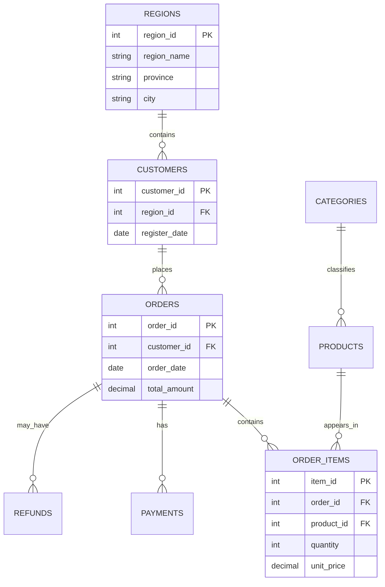

# 第三章 数据库、SQL 与电商业务模型

> 本章对应教学基线 `4d71b3c`。本章最后核对日期为 2026-07-10。

## 3.1 本章目标

> 完成本章后，你应该能够：
>
> 1. 解释表、行、列、主键和外键；
> 2. 画出项目八张电商表的关系；
> 3. 使用 `SELECT`、`WHERE`、`GROUP BY`、`JOIN`、`ORDER BY` 和 `LIMIT` 编写只读查询；
> 4. 区分订单级销售额和商品类别级销售额口径；
> 5. 理解种子数据为什么可重复生成，以及重复生成会修改什么数据；
> 6. 使用自动化测试验证表结构和固定数据规模。

## 3.2 问题场景

> 用户说“统计华东地区每个月的销售额”，数据库里并不存在一个叫“华东月度销售额”的字段。系统需要把问题拆成：
>
> - 指标：销售额；
> - 时间维度：月份；
> - 地区筛选：华东；
> - 事实表：`orders`；
> - 地区路径：`orders → customers → regions`；
> - 时间字段：`orders.order_date`。
>
> 如果不知道表之间如何关联，模型即使理解中文也无法写出可靠 SQL。因此数据库模型是整个 Agent 的地基。

## 3.3 关系型数据库基础

### 3.3.1 表、行和列

> 表表示一类实体或事件，列描述属性，行表示一条具体记录。例如 `orders` 是订单表，`order_id`、`customer_id`、`order_date` 是列，一行表示一张订单。

| order_id | customer_id | order_date | status | total_amount |
|---:|---:|---|---|---:|
| 101 | 12 | 2024-03-18 | Completed | 899.00 |

### 3.3.2 主键

> 主键用于唯一标识一行。`orders.order_id` 是订单表主键，不同订单不能使用同一个 `order_id`。

### 3.3.3 外键

> 外键表示表之间的关系。`orders.customer_id` 引用 `customers.customer_id`，说明每张订单属于一个客户。外键不等于把客户姓名复制到订单表，而是保存稳定的客户 ID。

### 3.3.4 一对多关系

> 一个客户可以有多张订单，所以 `customers → orders` 是一对多；一张订单可以有多条商品明细，所以 `orders → order_items` 也是一对多。

## 3.4 八张业务表

| 表 | 表示什么 | 主键 | 关键外键 | 常见分析用途 |
|---|---|---|---|---|
| `regions` | 地区 | `region_id` | 无 | 地区、省份、城市分析 |
| `customers` | 客户 | `customer_id` | `region_id` | 客户数量、年龄、地区、注册时间 |
| `categories` | 商品类别 | `category_id` | 无 | 类别聚合 |
| `products` | 商品 | `product_id` | `category_id` | 商品、价格、成本和类别 |
| `orders` | 订单主表 | `order_id` | `customer_id` | 订单数、销售额、日期和状态 |
| `order_items` | 订单商品明细 | `item_id` | `order_id`、`product_id` | 商品销量、明细金额和毛利润 |
| `payments` | 支付记录 | `payment_id` | `order_id` | 支付方式、状态和实付金额 |
| `refunds` | 退款记录 | `refund_id` | `order_id` | 退款率、金额和原因 |

## 3.5 表关系图



> 关系图只展示理解主链路所需的部分字段。完整字段定义以 `database/init.sql` 为准。

## 3.6 阅读建表 SQL

```sql
CREATE TABLE IF NOT EXISTS orders (
    order_id INTEGER PRIMARY KEY,
    customer_id INTEGER,
    order_date DATE,
    status VARCHAR,
    total_amount DECIMAL(10,2),
    FOREIGN KEY (customer_id) REFERENCES customers(customer_id)
);

CREATE TABLE IF NOT EXISTS order_items (
    item_id INTEGER PRIMARY KEY,
    order_id INTEGER,
    product_id INTEGER,
    quantity INTEGER,
    unit_price DECIMAL(10,2),
    FOREIGN KEY (order_id) REFERENCES orders(order_id),
    FOREIGN KEY (product_id) REFERENCES products(product_id)
);
```

> `IF NOT EXISTS` 允许在表已经存在时再次执行建表脚本。它不会自动更新旧表字段，因此正式数据库结构变更需要迁移工具，而不是只修改 `init.sql`。
>
> `DECIMAL(10,2)` 适合金额，最多 10 位数字，其中 2 位小数。金额不宜使用二进制浮点类型作为唯一事实来源，因为浮点表示可能产生精度误差。

## 3.7 SQL 查询的基本结构

```sql
SELECT
    strftime(order_date, '%Y-%m') AS month,
    SUM(total_amount) AS sales_amount
FROM orders
WHERE order_date >= DATE '2024-01-01'
  AND order_date < DATE '2025-01-01'
GROUP BY month
ORDER BY month
LIMIT 1000;
```

| 子句 | 作用 | 本例含义 |
|---|---|---|
| `SELECT` | 选择输出列和计算表达式 | 输出月份和销售额 |
| `FROM` | 指定数据来源 | 从订单表读取 |
| `WHERE` | 在聚合前过滤行 | 只保留 2024 年订单 |
| `GROUP BY` | 按维度分组 | 每个月形成一组 |
| `ORDER BY` | 指定结果顺序 | 月份从早到晚 |
| `LIMIT` | 限制返回行数 | 最多返回 1000 行 |

> SQL 的逻辑处理顺序与书写顺序不完全相同。理解当前项目时，可以先记住数据大致经过 `FROM/JOIN → WHERE → GROUP BY → SELECT → ORDER BY → LIMIT`。

## 3.8 JOIN 如何连接业务路径

### 3.8.1 地区销售额

```sql
SELECT
    r.region_name,
    SUM(o.total_amount) AS sales_amount
FROM orders AS o
JOIN customers AS c
  ON o.customer_id = c.customer_id
JOIN regions AS r
  ON c.region_id = r.region_id
GROUP BY r.region_name
ORDER BY sales_amount DESC
LIMIT 1000;
```

> `orders` 没有地区字段，必须先通过 `customer_id` 找到客户，再通过 `region_id` 找到地区。漏掉任意一个 JOIN，SQL 都无法得到正确的地区维度。

### 3.8.2 商品类别销售额

```sql
SELECT
    c.category_name,
    SUM(oi.quantity * oi.unit_price) AS sales_amount
FROM order_items AS oi
JOIN products AS p
  ON oi.product_id = p.product_id
JOIN categories AS c
  ON p.category_id = c.category_id
GROUP BY c.category_name
ORDER BY sales_amount DESC
LIMIT 1000;
```

> 按商品类别拆分时使用订单明细的 `quantity * unit_price`。如果把 `orders.total_amount` 与 `order_items` JOIN 后直接求和，一张包含多条明细的订单总额会被重复计算。

## 3.9 指标口径不是字段翻译

| 业务指标 | 当前项目语义表达式 | 关键注意点 |
|---|---|---|
| 销售额 | `SUM(orders.total_amount)` | 按类别拆分时改用明细金额 |
| 订单数 | `COUNT(DISTINCT orders.order_id)` | 多表 JOIN 后仍需去重 |
| 客户数 | `COUNT(DISTINCT customers.customer_id)` | 关注客户实体而非订单行数 |
| 客单价 | 销售额除以去重订单数 | 分母为 0 时需要安全处理 |
| 退款率 | 退款记录数除以去重订单数 | 当前项目采用订单维度口径 |
| 复购率 | 下单超过 1 次的客户占比 | 通常需要先按客户聚合 |

> “销售额”可以有是否排除取消订单、使用订单金额还是实付金额、是否扣除退款等不同业务定义。当前项目的确切教学口径来自 `backend/app/semantic/ecommerce_metrics.yaml`，不能只根据日常语言自行猜测。

## 3.10 DuckDB 与 PostgreSQL

| 特性 | DuckDB | PostgreSQL |
|---|---|---|
| 运行方式 | 嵌入 Python 进程，数据库可保存为单文件 | 独立数据库服务 |
| 初学成本 | 低，不需要单独启动服务 | 需要账号、端口、数据库和权限配置 |
| 典型用途 | 本地分析、演示和测试 | 多用户、持久服务和生产扩展 |
| 当前 SQL 生成默认方言 | 是 | 否，切换时需要额外验证 |

> 两者都支持大量标准 SQL，但日期函数、类型、系统表和执行计划存在差异。项目默认要求 LLM 生成 DuckDB 方言 SQL，不能因为配置了 PostgreSQL 就假设所有 Prompt 和评测已经自动切换方言。

## 3.11 种子数据如何生成

### 3.11.1 固定随机种子

```python
def seed_database(connection=None, verbose=True):
    random.seed(42)
    regions = generate_regions()
    categories = generate_categories()
    products = generate_products()
    customers = generate_customers()
    orders, order_items = generate_orders_and_items(products, customers)
    payments = generate_payments(orders)
    refunds = generate_refunds(orders)
```

> 每次进入 `seed_database` 都重新设置 `random.seed(42)`，相同代码和参数会生成相同数据。这让测试、评测和文档示例具有可重复性。

### 3.11.2 按外键依赖删除旧数据

```python
TABLE_DELETE_ORDER = [
    "refunds",
    "payments",
    "order_items",
    "orders",
    "customers",
    "products",
    "categories",
    "regions",
]
```

> 种子脚本会先清空旧数据再插入固定数据。删除顺序从依赖别人记录的子表开始，避免父表仍被外键引用。
>
> 这意味着 seed 不是只读操作。运行前必须确认 `DATABASE_URL` 指向本地演示库或隔离测试库，不能指向真实业务数据库。

### 3.11.3 当前固定数据规模

> 自动化测试 `backend/tests/test_seed_data.py` 对关键表数量建立了明确断言。

| 表 | 当前固定数量 |
|---|---:|
| `regions` | 30 |
| `categories` | 8 |
| `products` | 200 |
| `customers` | 1000 |
| `orders` | 5511 |
| `refunds` | 718 |

> 其他表数量由订单和商品明细生成逻辑决定。文档中如果出现与测试不同的旧数字，应以当前代码和测试为准。

## 3.12 代码地图

| 主题 | 文件 |
|---|---|
| DuckDB 表结构 | `database/init.sql` |
| PostgreSQL 表结构 | `database/init_pg.sql` |
| 种子数据生成 | `database/seed_data.py` |
| 数据库设计说明 | `docs/database_design_md.md` |
| 业务指标和维度 | `backend/app/semantic/ecommerce_metrics.yaml` |
| 种子数据回归测试 | `backend/tests/test_seed_data.py` |

## 3.13 动手验证

### 3.13.1 运行可重复种子测试

```bash
pytest backend/tests/test_seed_data.py -q
```

> 该测试在临时目录创建独立 DuckDB，连续运行两次 seed，并断言关键表数量不变。它不会修改项目默认演示数据库。

### 3.13.2 初始化本地演示数据库

```bash
python -m database.seed_data
```

> 只有确认 `.env` 指向本地学习数据库后才执行该命令。预期终端输出八张表的数据数量，并在最后逐表验证记录数。

### 3.13.3 使用 Python 执行只读查询

```bash
python -c "import duckdb; c=duckdb.connect('data/database.duckdb', read_only=True); print(c.execute('SELECT status, COUNT(*) FROM orders GROUP BY status ORDER BY status').fetchall()); c.close()"
```

> `read_only=True` 明确使用只读连接。验收标准是返回多个订单状态及数量，不修改任何表。

## 3.14 常见错误

### 3.14.1 JOIN 后销售额异常放大

> 检查一对多关系。把订单总额 JOIN 到多条订单明细后，每条明细都会携带同一个订单总额。按商品分析应使用明细金额，按订单分析需要避免重复行或使用去重策略。

### 3.14.2 订单数使用 `COUNT(*)`

> 单表查询时 `COUNT(*)` 可能等于订单数，多表 JOIN 后它统计的是结果行数。业务订单数通常使用 `COUNT(DISTINCT orders.order_id)`。

### 3.14.3 使用 MySQL 或其他方言函数

```text
Unknown function or parser error
```

> 当前默认方言是 DuckDB。月份可以使用 `strftime(order_date, '%Y-%m')` 或 `DATE_TRUNC`，不要直接复制 `DATE_FORMAT`、`GETDATE()` 等其他数据库写法。

### 3.14.4 seed 修改了不该修改的数据库

> seed 会删除八张业务表的现有记录并重建数据。执行前检查 `DATABASE_URL`，生产数据绝不能通过学习用 seed 脚本初始化。

### 3.14.5 把文档建议规模当成当前事实

> 早期数据库设计文档可能写过建议规模，当前真实固定规模由 `database/seed_data.py` 和 `backend/tests/test_seed_data.py` 共同证明。学习时要区分“设计建议”和“当前实现”。

## 3.15 本章小结

> 八张表形成一条清晰的电商分析主链：客户属于地区，客户产生订单，订单包含商品明细，商品属于类别，订单还关联支付和退款。
>
> SQL 不只是语法组合。正确查询依赖业务口径、JOIN 基数、去重策略、时间字段和数据库方言。种子数据通过固定随机种子和重复重建机制，为后续测试和评测提供稳定事实。

## 3.16 练习

> 1. 画出“按地区统计退款率”需要经过的表和 JOIN；
> 2. 编写只读 SQL，统计每种支付方式的已支付金额；
> 3. 分别写出订单级销售额和商品类别级销售额表达式，解释为什么不同；
> 4. 阅读 `generate_payments`，说明取消订单和退款订单的支付状态如何生成；
> 5. 修改一个临时数据库中的随机种子，比较结果数量和分布变化，不要修改项目默认数据库；
> 6. 解释为什么 seed 清表顺序从 `refunds` 开始，而不是从 `regions` 开始。

## 3.17 下一章衔接

> 现在你已经理解数据库中有哪些事实。下一章会学习程序如何建立数据库连接、从 `information_schema` 读取表和列，并把物理 Schema 整理成 LLM 和安全模块可以使用的上下文。

